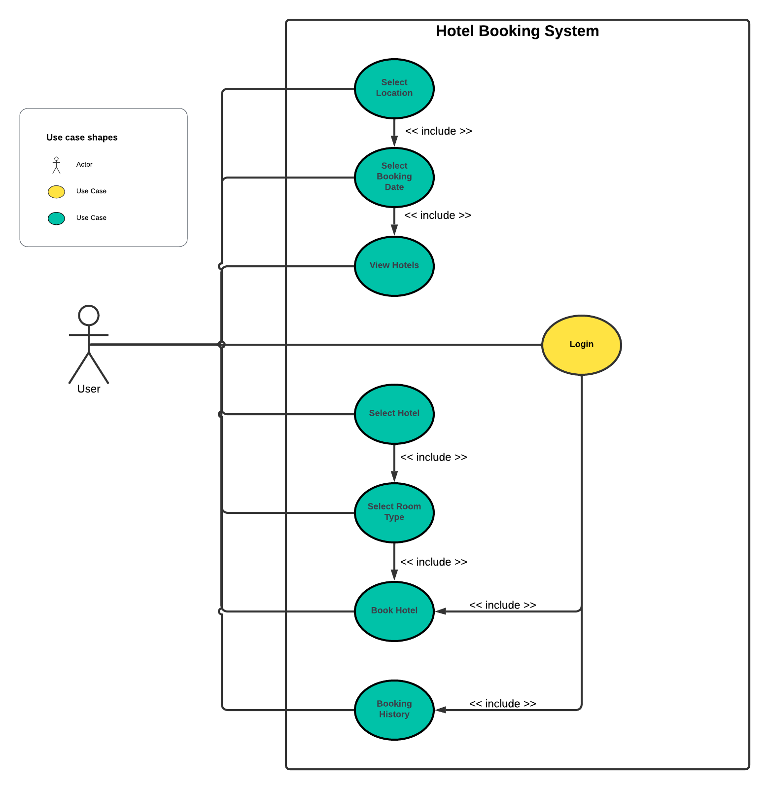
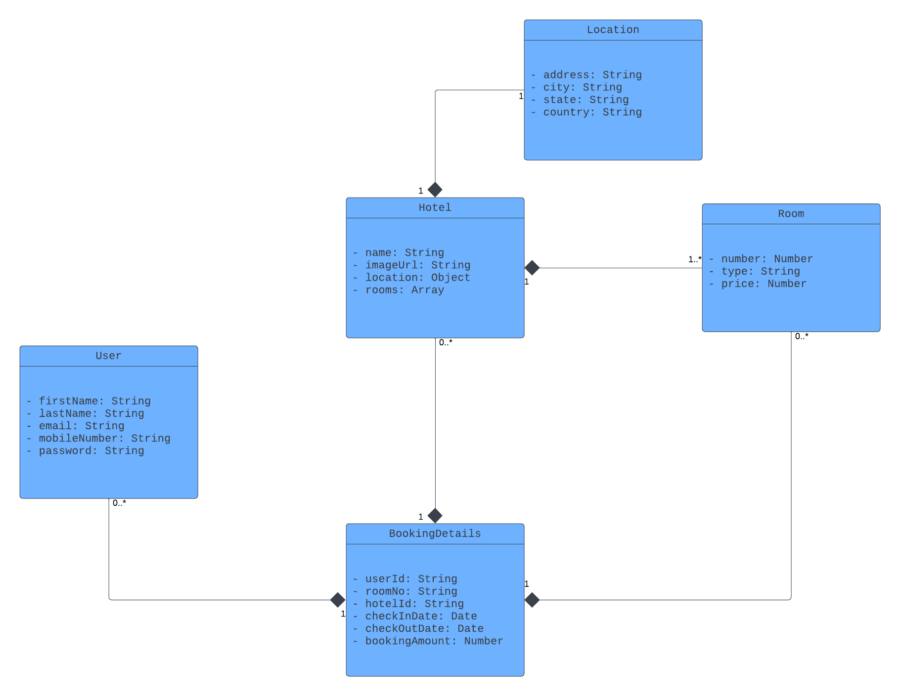

# hotel-booking-application-backend
This is the backend repository for a hotel booking application

## Steps to run the app locally

1. clone the repository <code>git clone https://github.com/0-jagadeesh-0/hotel-booking-application-backend.git</code>

2. <code>npm install</code>

3. <code>define .env in under root directory and add MONGODB_URI(MongoDB URI), JWT_SECRET and PORT</code> 

4. <code>npm start</code>

## Use case Diagram

## Schema Design

## Models

### User model
   - firstName: first name of the user
   - lastName: last name of the user
   - email: email of the user
   - moblieNumber: mobile number of the user
   - password: password of the user
   
### Hotel model
   - name: hotel name
   - imageUrl: link of the hotel image
   - location: location of the hotel
   - rooms: rooms in the hotel

### BookingDetails model
   - userId: user id
   - hotelId: total orders made by the user
   - roomNo: room no of the booked hotel
   - checkInDate: checkin date
   - checkOutDate: checkout date
   - bookingAmount: booking price of the room.

## APIs

### Auth Endpoints

#### Signup User(POST)
   - /api/v1/auth/signup
   - User can signup by adding firstName, lastName, email, mobileNumber and password.
#### Signin User(POST)
   - /api/v1/auth/signup
   - User can signin with email and password.

### User Endpoints

#### User Details(GET)
   - /api/v1/users/getDetails/:userId (where userId is the path variable)
   - To fetch the details of the user.

### Hotel Endpoints

#### Get All hotels(GET)
   - /api/v1/hotels
   - Fetch all the hotels.

#### Get All hotels by city(GET)
   - /api/v1/hotels/city/:cityId(where cityId is the path variable)
   - Fetches all the hotels in a particular city

#### Get Hotel Details(GET)
   - /api/v1/hotels/:hotelId(where hotelId is the path variable)
   - Fetches the details of a particular hotel.

#### Get Available Rooms in a hotel(GET)
   - /api/v1/hotels/rooms/:hotelId?checkInDate="checkInDate"&checkOutDate="checkOutDate"(where hotelId is the path variable and checkIndate and checkOutDate are query params)
   - Fetches the available rooms in a hotels in between the given checkin and checkout dates.

### Booking Endpoints

#### Add New booking(POST)
   - /api/v1/bookings/add
   - creates new hotel booking

#### Booking History of a user(GET)
   - /api/v1/bookings/history/:userId (where userId is the path variable)
   - Fetches the booking history of the user.

